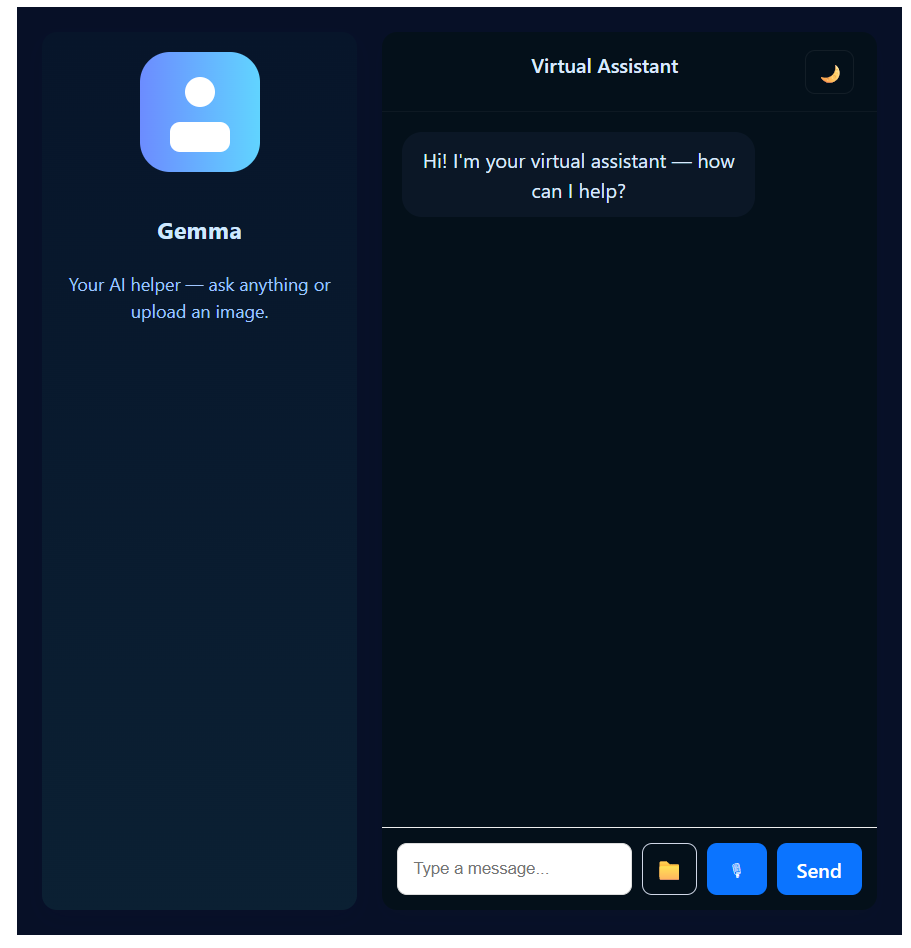

# 🤖 AI Model – Docker Model Based Architecture

This project is an **AI-powered Virtual Assistant** built with a **Dockerized AI model**, a **Node.js backend**, and a **React.js frontend**.  
The AI model runs **internally inside Docker** (not exposed publicly), while the backend securely communicates with it and serves responses to the frontend.

---
## 🖥️ UI Preview

## 🚀 Tech Stack

### Frontend
- React.js
- Axios
- Modern UI (Chat-style interface)

### Backend
- Node.js
- Express.js
- REST APIs
- Runs on **EC2 – Port 5000**

### AI Model
- Docker Models (Gemma)
- Runs **internally on `localhost:12434`**
- Not publicly accessible (security-first design)

### Infrastructure
- AWS EC2
- Docker & Docker Hub
- Linux (Ubuntu)

---

## 🧠 Architecture Overview

Browser (React UI)
|
| HTTP Requests
v
Backend (Node.js :5000) ← Public
|
| Internal API Call
v
Docker AI Model (:12434) ← Internal Only

🔐 **Important:**  
- The AI model **cannot be accessed directly from the internet**
- Only the backend can communicate with the model
- This ensures **security, control, and scalability**

---

## ✨ Key Features

### 🔹 Docker Model Isolation
- AI model runs **inside Docker**
- Bound only to `localhost`
- Prevents unauthorized access

### 🔹 Secure Backend Proxy
- Backend acts as a **controlled gateway**
- Handles prompts, validation, and responses
- Frontend never talks to the model directly

### 🔹 Modular & Scalable Design
- Frontend, backend, and model are **decoupled**
- Easy to upgrade model without UI/backend changes
- Cloud-ready architecture

### 🔹 Production-Oriented Setup
- Similar to **real-world AI systems**
- Follows microservice principles
- Suitable for scaling with Kubernetes later

---

## 🔁 Streaming responses (word-by-word)
This project now supports streaming model responses to the frontend so the UI can display replies progressively (word-by-word), similar to ChatGPT.

- Backend endpoint: `GET /api/chat-stream?message=<your message>` — returns Server-Sent Events (SSE) with small text chunks.
- Frontend: uses `EventSource` to receive chunks and updates the assistant message in real time.

Quick test (server must be reachable from your browser):
- From browser (app running): send a message in the UI — the assistant will appear token-by-token.
- Using curl (dev):
  curl -N "http://localhost:5000/api/chat-stream?message=hello"

Notes:
- The backend forwards the model's streaming output as SSE and attempts to split/stream text chunks as they arrive.
- If your model's streaming format differs, you may need to adapt parsing in `backend/index.js` (the SSE relaying logic).

---

## 🎨 UI Improvements
- Updated chat styling, smoother bubbles, and a typing indicator while streaming.
- Styles are in `frontend/src/App.css` and can be tweaked for theme or branding.

---

## 🧪 Testing & Troubleshooting
- Ensure the backend is reachable externally (bind to `0.0.0.0` and open port 5000 in your firewall/EC2 Security Group).
- For development, keep Vite proxy configured (see `frontend/vite.config.js`) so `/api` requests forward to the backend on `localhost:5000`.

If you'd like, I can add an example curl script or a small test page that demonstrates streaming without the full UI.
